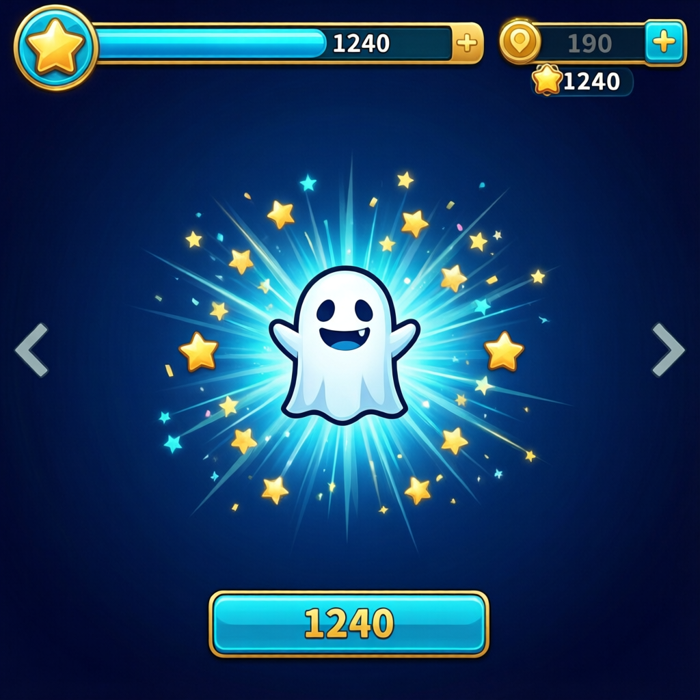

<p align="center">
  
</p>

<h1 align="center">crosscorr</h1>
<p align="center"><i>International open-source project for cross-correlation analysis</i></p>
# CrossCorr

**Кросс-корреляционный анализ аномалий в разнородных временных рядах**

Семейный исследовательский проект, в котором мы ищем статистически значимые связи между данными из сейсмологии, магнитометрии, ионосферы, биологии, астрономии и других источников. Проект сочетает научный анализ, открытые данные и игровые инструменты для вовлечения детей в исследования.

[](https://www.python.org/)
[](https://streamlit.io/)
[](LICENSE)
[]()
[](https://github.com/FelixRLEPERS/crosscorr/commits/main)

---

## 📖 Оглавление

- [О проекте](#о-проекте)
- [Методология](#методология)
- [Структура репозитория](#структура-репозитория)
- [Быстрый старт](#быстрый-старт)
- [Данные](#данные)
- [Пайплайн анализа](#пайплайн-анализа)
- [Игра и голосовой наставник](#игра-и-голосовой-наставник)
- [Результаты](#результаты)
- [Статус проекта](#статус-проекта)
- [Команда](#команда)
- [Документация](#документация)
- [Вклад ИИ](#вклад-ии)
- [Скриншоты](#скриншоты)
- [Лицензия](#лицензия)
- [Контакты](#контакты)

---

## 🎯 О проекте

**CrossCorr** — это открытый исследовательский проект, который объединяет разнородные временные ряды и проверяет гипотезы о наличии кросс-корреляций между ними. Мы не ищем «магическую связь», а строим воспроизводимый пайплайн: от загрузки и унификации данных до статистических тестов с контролем ложных обнаружений.

Проект задуман как семейный: папа отвечает за стратегию и код, мама — за коммуникации и тексты, Макар — за исследования, Егор — за данные и визуализацию. Мы хотим показать, что настоящая наука может быть совместным семейным делом.

**Ключевые принципы:**

- Открытые данные и открытый код.
- Воспроизводимость каждого шага.
- Статистическая строгость: surrogate-тесты, FDR-коррекция, байесовские модели.
- Игровые форматы для вовлечения детей.
- Прозрачность: явно указываем, где помогал ИИ.

---

## 🔬 Методология

1. **Унификация данных**
   Все источники приводятся к единому формату:
   ```text
   timestamp_utc, detector_id, detector_type, residual, meta
   ```

2. **Базовая модель**
   Оценка остатков через смешанную линейную модель:
   ```text
   v0 ~ T_заряда + масса + (1|полигон)
   ```
   Реализация: `statsmodels` MixedLM.

3. **Пространственная модель**
   Байесовская модель с экспоненциальным ядром ковариации для учёта пространственной структуры.
   Реализация: `PyMC`.

4. **Кросс-корреляционный анализ**
   Построение матрицы корреляций между детекторами и временными рядами.
   Реализация: `code/analysis/cross_correlation.py`.

5. **Мультифрактальный анализ**
   MFDFA для оценки фрактальных свойств рядов.
   Реализация: `MFDFA`, `code/analysis/mfdfa.py`.

6. **Surrogate-тесты**
   Генерация 1000+ фазовых суррогатов для проверки значимости наблюдаемых корреляций.
   Реализация: `code/analysis/surrogate.py`.

7. **FDR-коррекция**
   Контроль доли ложных обнаружений (Benjamini–Hochberg) при множественных сравнениях.

Подробнее: [docs/methodology.md](docs/methodology.md)

---

## 📁 Структура репозитория

```text
crosscorr/
├── README.md
├── LICENSE
├── requirements.txt
├── .gitignore
├── code/
│   ├── quest.py                # Streamlit-игра
│   ├── narrator.py             # голосовой наставник (edge-tts)
│   ├── ai_narrator.py          # AI-наставник
│   └── analysis/
│       ├── README.md
│       ├── cross_correlation.py
│       ├── surrogate.py
│       └── mfdfa.py
├── data/
│   ├── README.md
│   ├── raw/                    # сырые данные (не коммитятся)
│   ├── interim/                # промежуточные (не коммитятся)
│   ├── processed/              # унифицированные (не коммитятся)
│   ├── samples/                # небольшие примеры для тестов
│   ├── schema/
│   │   └── unified_schema.json
│   └── scripts/
│       ├── download_wspr.py
│       ├── download_intermagnet.py
│       ├── download_horizons.py
│       ├── unify_schema.py
│       └── make_sample.py
├── docs/
│   ├── methodology.md
│   ├── roadmap.md
│   └── quest.md
├── results/                    # графики, таблицы, p-values
├── images/
└── paper/
    ├── work.tex
    └── references.bib
```

---

## 🚀 Быстрый старт

### Требования

- Python 3.10+
- Git
- Streamlit
- Рекомендуется виртуальное окружение

### Установка

```bash
git clone https://github.com/FelixRLEPERS/crosscorr.git
cd crosscorr
python -m venv .venv
source .venv/bin/activate      # Linux / macOS
# .venv\Scripts\activate       # Windows
pip install -r requirements.txt
```

### Запуск игры

```bash
streamlit run code/quest.py
```

### Запуск голосового наставника

```bash
python code/narrator.py
```

### Запуск AI-наставника

```bash
python code/ai_narrator.py
```

---

## 📊 Данные

Проект использует открытые источники. Сырые данные **не коммитятся** в репозиторий — только скрипты загрузки и небольшие примеры (`data/samples/`).

| Источник | Тип данных | Ссылка |
|---|---|---|
| WSPR | Распространение радиосигналов | [wsprnet.org](https://wsprnet.org/) |
| NGL | GNSS-данные | [ngl.unavco.org](https://ngl.unavco.org/) |
| INTERMAGNET | Магнитное поле Земли | [intermagnet.org](https://intermagnet.org/) |
| Oulu | Ионосферные данные | [cosmic.rl.ac.uk](https://cosmic.rl.ac.uk/) |
| Ammolytics | Баллистические данные | [ammolytics.com](https://ammolytics.com/) |
| BIPM | Метрологические данные | [bipm.org](https://www.bipm.org/) |
| 1000 Genomes | Генетические данные | [internationalgenome.org](https://www.internationalgenome.org/) |
| JPL Horizons | Эфемериды | [ssd.jpl.nasa.gov](https://ssd.jpl.nasa.gov/horizons/) |

Формат унифицированной таблицы и правила добавления данных описаны в [data/README.md](data/README.md).
JSON-схема: [data/schema/unified_schema.json](data/schema/unified_schema.json).

---

## 🔬 Пайплайн анализа

Полное описание: [code/analysis/README.md](code/analysis/README.md).

Кратко:

```bash
# 1. Скачать данные
python data/scripts/download_wspr.py --date 2025-01-01
python data/scripts/download_intermagnet.py --file path/to/file.min
python data/scripts/download_horizons.py --planet mars --start 2025-01-01 --stop 2025-02-01

# 2. Унифицировать
python data/scripts/unify_schema.py

# 3. Сделать сэмпл для тестов
python data/scripts/make_sample.py

# 4. Кросс-корреляция
python code/analysis/cross_correlation.py --freq 1h --method spearman

# 5. Surrogate-тесты и FDR
python code/analysis/surrogate.py --n 1000 --alpha 0.05

# 6. MFDFA
python code/analysis/mfdfa.py
```

Артефакты анализа сохраняются в `results/`:

- `results/cross_correlation.csv`
- `results/cross_correlation.png`
- `results/surrogate_pvalues.csv`
- `results/surrogate_significant.csv`
- `results/mfdfa_spectra.csv`

---

## 🎮 Игра и голосовой наставник

Игровой модуль для детей 11–13 лет. Сюжет — «Охота на призрака»: ребёнок ищет сверхмалые корреляции в данных.

- `code/quest.py` — интерактивный квест (Streamlit, видео-фон, музыка).
- `code/narrator.py` — голосовой наставник на базе `edge-tts` (бесплатно, без API-ключей).
- `code/ai_narrator.py` — AI-наставник, объясняющий результаты анализа.

Подробное описание сюжета и уровней: [docs/quest.md](docs/quest.md).

---

## 📈 Результаты

Раздел будет пополняться по мере прогонов пайплайна.

- [ ] Первый прогон на одном дне WSPR + Horizons
- [ ] Кросс-корреляционная матрица за неделю
- [ ] Surrogate-тесты (n=1000) с FDR
- [ ] MFDFA-спектры по всем детекторам

Графики появятся в `results/` и будут вставлены в [Скриншоты](#скриншоты).

---

## 📊 Статус проекта

- ✅ Пайплайн загрузки данных (WSPR, INTERMAGNET, Horizons)
- ✅ Унификация схемы данных
- ✅ Кросс-корреляционный анализ
- ✅ Surrogate-тесты + FDR
- ✅ MFDFA-анализ
- ✅ Игра для детей
- 🚧 Голосовой наставник (в разработке)
- 🚧 AI-наставник (в разработке)
- 🚧 Базовая MixedLM-модель для оценки остатков
- 🚧 Тесты (`pytest`) и CI (GitHub Actions)
- 📅 Публикация препринта (план: Q1 2026)

Актуальный план: [docs/roadmap.md](docs/roadmap.md)

---

## 👨‍👩‍👦 Команда

| Роль | Участник | Зона ответственности |
|---|---|---|
| CEO | Папа | Стратегия, архитектура, код |
| Communications | Мама | Тексты, презентации, связи |
| Research | Макар | Исследования, эксперименты |
| Researcher | Егор | Данные, визуализация |

---

## 📚 Документация

- [Методология](docs/methodology.md)
- [План развития](docs/roadmap.md)
- [Игра и сюжет](docs/quest.md)
- [Пайплайн анализа](code/analysis/README.md)
- [Описание данных](data/README.md)
- [Статья (LaTeX)](paper/work.tex)
- [Библиография](paper/references.bib)

---

## 🤖 Вклад ИИ

Проект использует ИИ как вспомогательный инструмент. Это указано явно, чтобы избежать вопросов о самостоятельности исследования.

Что делает ИИ:
- генерация черновиков кода и текстов,
- помощь в формулировке гипотез,
- озвучка (через `edge-tts`),
- структурирование документации.

Что делает человек:
- постановка задачи и гипотез,
- выбор методов и интерпретация результатов,
- валидация кода и данных,
- финальные выводы и публикации.

---

## 🖼️ Скриншоты




---

## 📄 Лицензия

Проект распространяется под лицензией **MIT**. Подробнее: [LICENSE](LICENSE).

---

## 📬 Контакты

- GitHub Issues: [github.com/FelixRLEPERS/crosscorr/issues](https://github.com/FelixRLEPERS/crosscorr/issues)
- Email: [felixrpepers@gmail.com]
- Сайт проекта: [felixrlepers.github.io/crosscorr](https://felixrlepers.github.io/crosscorr/)

---

> Если вы нашли ошибку или хотите предложить идею — создайте Issue или Pull Request. Мы открыты к сотрудничеству.
