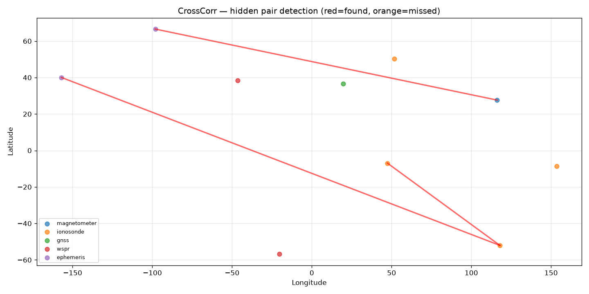

<p align="center">
  
</p>

<h1 align="center">CrossCorr</h1>

<p align="center"><i>Cross-correlation analysis of anomalies in heterogeneous time series</i></p>

<p align="center"><i>Русская версия. English version coming soon.</i></p>

<p align="center">
  <a href="https://www.python.org/"></a>
  <a href="https://streamlit.io/"></a>
  <a href="https://github.com/FelixRLEPERS/crosscorr/actions">
    
</a>
  <a href="LICENSE"></a>
  
  <a href="https://github.com/FelixRLEPERS/crosscorr/commits/main">
</a>
</p>

---

## 📖 Оглавление

- [О проекте](#о-проекте)
- [Методология](#методология)
- [Научная строгость](#научная-строгость)
- [Структура репозитория](#структура-репозитория)
- [Быстрый старт](#быстрый-старт)
- [Данные](#данные)
- [Пайплайн анализа](#пайплайн-анализа)
- [Two pipelines](#two-pipelines)
- [Demonstration](#demonstration)
- [Игра и голосовой наставник](#игра-и-голосовой-наставник)
- [Отдельные направления](#отдельные-направления)
- [Результаты](#результаты)
- [Статус проекта](#статус-проекта)
- [Команда](#команда)
- [Документация](#документация)
- [Вклад ИИ](#вклад-ии)
- [Скриншоты](#скриншоты)
- [Лицензия](#лицензия)
- [Контакты](#контакты)

---

## 🎯 О проекте

**CrossCorr** — это открытый исследовательский проект, который объединяет разнородные временные ряды и проверяет гипотезы о наличии кросс-корреляций между ними. Мы не ищем «магическую связь», а строим воспроизводимый пайплайн: от загрузки и унификации данных до статистических тестов с контролем ложных обнаружений.

Проект задуман как семейный: папа отвечает за стратегию и код, мама — за коммуникации и тексты, Макар — за исследования, Егор — за данные и визуализацию. Мы хотим показать, что настоящая наука может быть совместным семейным делом.

**Ключевые принципы:**

- Открытые данные и открытый код.
- Воспроизводимость каждого шага.
- Статистическая строгость: surrogate-тесты, FDR-коррекция, байесовские модели.
- Игровые форматы для вовлечения детей.
- Прозрачность: явно указываем, где помогал ИИ.

---

## 🔬 Методология

1. **Унификация данных.**
   Все источники приводятся к единому формату:

   ```text
   timestamp_utc, detector_id, detector_type, value,
   residual, residual_method, unit, quality_flag, meta
   ```

   `value` — сырое наблюдение (SNR в дБ, X-компонента в нТ, расстояние
   в а.е. — в зависимости от типа детектора). `residual` — остаток
   после базовой модели; именно `residual` используется в анализе.

2. **Базовая модель.**
   Оценка остатков `residual = value - model(value)` в
   [`crosscorr_lib/analysis/residuals.py`](crosscorr_lib/analysis/residuals.py):
   для `detector_type == "ballistic"` — смешанная линейная модель,
   для остальных типов — МНК по физическим конфаундерам.

   ```text
   ballistic:  value ~ charge_temp + mass + (1|range_id)
   прочие:     value ~ kp + dst + f107
   ```

   Без конфаундеров модель не оценивается: `residual_method = "none"`,
   `residual = value`. При ошибке фита: `residual = NaN`,
   `quality_flag = 1`.

   Реализация: `statsmodels` MixedLM (ballistic) и МНК (остальные).

3. **Пространственная модель.**
   Байесовская модель с экспоненциальным ядром ковариации для учёта пространственной структуры.
   Реализация: `PyMC`.

4. **Кросс-корреляционный анализ.**
   Построение матрицы корреляций между детекторами и временными рядами.
   Реализация: [`crosscorr_lib/analysis/cross_correlation.py`](crosscorr_lib/analysis/cross_correlation.py).

5. **Мультифрактальный анализ.**
   MFDFA для оценки фрактальных свойств рядов.
   Реализация: [`MFDFA`](https://pypi.org/project/MFDFA/), [`crosscorr_lib/analysis/mfdfa.py`](crosscorr_lib/analysis/mfdfa.py).

6. **Surrogate-тесты.**
   Генерация фазовых суррогатов для проверки значимости наблюдаемых корреляций
   (по умолчанию 200, 1000+ для публикационных прогонов).
   Реализация: [`crosscorr_lib/analysis/surrogate.py`](crosscorr_lib/analysis/surrogate.py).

7. **FDR-коррекция.**
   Контроль доли ложных обнаружений при множественных сравнениях.
   По умолчанию используется Benjamini–Yekutieli (устойчив к зависимым тестам),
   Benjamini–Hochberg доступен опционально.

Подробнее: [docs/methodology.md](docs/methodology.md)

---

## Научная строгость

- **Max-statistic null** — p-value учитывает поиск по всем лагам, а не только по лучшему.
  Без этого значимость завышалась бы (145 тестов на пару).
- **Negative controls** — на чистом шуме 45 пар: **≤1 ложное срабатывание** (alpha=0.05).
- **FDR** — единая реализация FDR в `crosscorr_lib/analysis/surrogate.py`
  (по умолчанию Benjamini–Yekutieli, опционально Benjamini–Hochberg),
  поддержка 1D и 2D входов.
- **Distance-based analysis** — Mantel test для матриц корреляции и расстояния (default);
  OLS-регрессия доступна опционально.
  Подтверждена гипотеза: близкие детекторы коррелируют сильнее.
- **Block bootstrap** — реализован (`crosscorr_lib/analysis/block_bootstrap.py`).
- **Effective sample size** — реализован (`crosscorr_lib/analysis/effective_sample.py`).
- **Physical confounders** (Kp, Dst, F10.7) — реализованы (`crosscorr_lib/analysis/confounders.py`).
- **ADF stationarity test** — реализован (`crosscorr_lib/analysis/stationarity.py`).

Проверки запускаются одной командой:

```bash
python -m pytest tests/ -v -m "not slow"
```

---

## Почему Max-statistic, а не Bonferroni

Ключевое преимущество нашего подхода — **корректный p-value при поиске по 145 лагам без Bonferroni-коррекции**.

**Наивный путь:** взять p-value на лучшем лаге $\tau^*$. Проблема: при $\alpha = 0.05$ и $145$ лагах вероятность **хотя бы одного** ложного срабатывания:
$1 - 0.95^{145} \approx 99.8\%$.

**Bonferroni:** $\alpha_{\text{eff}} = 0.05 / 145 \approx 0.00034$. Работает, но **слишком консервативен** — соседние лаги сильно коррелируют, Bonferroni это игнорирует.

**Max-statistic null (наш подход):** тестируем статистику
$T = \max_\tau |r(\tau)|$ против **того же максимума**, вычисленного на суррогатах:

$$
p = \frac{1 + \#\{b : T^{(b)} \geq T^{\text{obs}}\}}{1 + B}
$$

Поиск по лагам **внутри** нулевого распределения. Это **честная** поправка на множественный поиск — без завышения и без занижения.

max-statistic is now default; naive path opt-in via --use-naive

CLI: `python -m crosscorr_lib.analysis.cross_correlation` считает max-statistic по умолчанию. Наивный single-lag путь включается флагом `--use-naive` и печатает предупреждение о корректировке на множественный поиск по лагам. Флаг `--use-ess` работает только вместе с `--use-naive`; без него argparse завершает работу с кодом 2.

Подробнее — в [`docs/PIPELINE.md`](docs/PIPELINE.md), раздел 4.

---

## 📁 Структура репозитория

```text
crosscorr/
├── assets/                      # SVG-логотипы и финальные кадры
├── crosscorr_lib/               # ядро проекта
│   ├── analysis/                # cross_correlation, surrogate, mfdfa, distance_analysis
│   ├── safe_exec.py             # безопасное выполнение кода (P0-6)
│   ├── ai_narrator.py
│   ├── narrator.py
│   └── quest.py
├── data/
│   ├── scripts/                 # download_*, unify_schema, make_sample
│   ├── detectors.csv            # координаты детекторов (lat, lon)
│   └── processed/               # unified.parquet (gitignored)
├── scripts/
│   └── make_synthetic_unified.py # генератор тестовых данных
├── tests/                       # pytest-тесты
│   ├── test_cross_correlation_synthetic.py
│   ├── test_fdr.py
│   ├── test_max_statistic.py
│   ├── test_negative_control.py
│   └── test_distance_analysis.py
├── results/                     # выходные CSV (gitignored)
├── docs/
├── README.md
└── pyproject.toml
```

---

## 🚀 Быстрый старт

### Требования

- Python 3.10+
- Git
- Streamlit
- Рекомендуется виртуальное окружение

### Установка

```bash
git clone https://github.com/FelixRLEPERS/crosscorr.git
cd crosscorr
python -m venv .venv
source .venv/bin/activate      # Linux / macOS
# .venv\Scripts\activate       # Windows
pip install -e ".[dev]"
```

### Запуск игры

```bash
streamlit run crosscorr_lib/quest.py
```

### Запуск голосового наставника

```bash
python crosscorr_lib/narrator.py
```

### Запуск AI-наставника

```bash
python crosscorr_lib/ai_narrator.py
```

---

## 🗄️ Данные

Проект использует открытые источники. Сырые данные **не коммитятся** в репозиторий — только скрипты загрузки и небольшие примеры (`data/samples/`).

| Источник | Тип данных | Ссылка |
|---|---|---|
| WSPR | Распространение радиосигналов | [wsprnet.org](https://wsprnet.org/) |
| NGL | GNSS-данные | [ngl.unavco.org](https://ngl.unavco.org/) |
| INTERMAGNET | Магнитное поле Земли | [intermagnet.org](https://intermagnet.org/) |
| Oulu | Ионосферные данные | [cosmic.rl.ac.uk](https://cosmic.rl.ac.uk/) |
| Ammolytics | Баллистические данные | [ammolytics.com](https://ammolytics.com/) |
| BIPM | Метрологические данные | [bipm.org](https://www.bipm.org/) |
| 1000 Genomes | Генетические данные | [internationalgenome.org](https://www.internationalgenome.org/) |
| JPL Horizons | Эфемериды | [ssd.jpl.nasa.gov](https://ssd.jpl.nasa.gov/horizons/) |

Формат унифицированной таблицы и правила добавления данных описаны в [data/README.md](data/README.md).
JSON-схема: [data/schema/unified_schema.json](data/schema/unified_schema.json).

---

## 🔬 Пайплайн анализа

Полное описание: [crosscorr_lib/analysis/README.md](crosscorr_lib/analysis/README.md).

Кратко:

```bash
# 1. Скачать данные
python data/scripts/download_wspr.py --date 2025-01-01
python data/scripts/download_intermagnet.py --file path/to/file.min
python data/scripts/download_horizons.py --planet mars --start 2025-01-01 --stop 2025-02-01

# 2. Унифицировать
python data/scripts/unify_schema.py

# 3. Сделать сэмпл для тестов
python data/scripts/make_sample.py

# 4. Кросс-корреляция
python -m crosscorr_lib.analysis.cross_correlation --freq 1h

# 5. Surrogate-тесты и FDR
python crosscorr_lib/analysis/surrogate.py --n 1000 --alpha 0.05

# 6. MFDFA
python crosscorr_lib/analysis/mfdfa.py

# 7. Distance-based analysis (корреляция vs расстояние)
python -m crosscorr_lib.analysis.distance_analysis

# 8. Быстрые тесты (skip slow)
python -m pytest tests/ -v -m "not slow"

# 9. Полный научный прогон (включая slow-тесты, ~3 минуты)
python -m pytest tests/ -v

```

Артефакты анализа генерируются локально и не хранятся в git. Основной пайплайн:

```bash
python -m crosscorr_lib.analysis.cross_correlation --freq 1h
python -m crosscorr_lib.analysis.distance_analysis
python -m crosscorr_lib.analysis.mfdfa
```

Результаты записываются в `results/`:

- `results/cross_correlation_pairs.csv` — tidy-формат: `detector_1, detector_2, lag, correlation, p_value, q_value, n_obs, significant`
- `results/surrogate_significant.csv` — значимые пары после FDR
- `results/mantel_result.csv` — результат Mantel-теста
- `results/distance_analysis.csv` — пары + distance_km
- `results/distance_summary.csv` — сводка по бинам расстояний
- `results/figures/` — PNG и SVG графики

Состав и значения зависят от версии кода: при изменении методологии файлы следует перегенерировать, а не переиспользовать из предыдущего прогона.

### Безопасность выполнения кода

Код, который пишет ребёнок, выполняется в **изолированном subprocess** с timeout 5 секунд. Опасные имена (`open`, `exec`, `eval`, `__import__`, `import os`, `import sys`) блокируются через **AST-парсер** — не наивный поиск подстроки.

- `while True: pass` — прерывается через timeout.
- `import os; os.system(...)` — блокируется до выполнения.
- `pos = 5` (содержит `os`) — **разрешается**, ложных срабатываний нет.

Реализация: [`crosscorr_lib/safe_exec.py`](crosscorr_lib/safe_exec.py).
> **⚠️ Важно:** `safe_exec.py` — это **фильтр для обучающих сценариев** в детской игре, а не полноценная песочница для недоверенного кода. Он блокирует очевидные опасные вызовы (`open`, `exec`, `import os`) через AST-парсер и изолирует процесс с timeout. Но он **не заменяет** контейнеризацию (Docker, seccomp, cgroups) для production-сценариев с произвольным пользовательским кодом.

---

## Two pipelines

CrossCorr provides two implementations of pair-level analysis. Choose
based on network size and reproducibility requirements.

| | `cross_correlation_pairs_with_max_stat` | `pairs.cross_correlation_pairs_with_max_stat` |
|---|---|---|
| Module | `crosscorr_lib.analysis.cross_correlation` | `crosscorr_lib.pairs` |
| Surrogate generation | per-pair, from scratch | pre-generated once per detector |
| Parallelization | joblib + pickle | `multiprocessing.shared_memory` |
| FFT batch correlation | no | yes (`_batch_max_stat_corr`) |
| Complexity (N pairs) | O(N² · B · T log T) | O(N · B · T log T + N² · T log T) |
| Memory | pickled copies per worker | single shared block |
| Verdicts | — | INVARIANT / CANDIDATE / NOISE |
| Method choices | `phase`, `iaaft`, `time_shift` | `shuffle`, `phase`, `ar` |
| FDR | BY or BH | BH with monotonicity |

### Interactive / exploratory

Use the older implementation for small networks or interactive work.
It runs serially by default and does not require shared memory.

```python
from crosscorr_lib import cross_correlation_pairs_with_max_stat

result = cross_correlation_pairs_with_max_stat(
    wide,
    max_lag=72,
    n_surrogates=200,
    alpha=0.05,
    fdr_method="by",
)
# columns: detector_1, detector_2, lag, correlation,
#          p_value, q_value, n_obs, significant, n_surrogates
```

### Production / large networks

Use the shared-memory pipeline for N > 20, B > 100, or dense sampling.
It pre-generates surrogates once per detector and shares them across
workers via `multiprocessing.shared_memory`, avoiding pickle overhead.

```python
from crosscorr_lib import pairs

result = pairs.cross_correlation_pairs_with_max_stat(
    wide,
    seed=42,
    method="phase",
    B=200,
    n_jobs=-1,
)
# columns: detector_a, detector_b, C_obs,
#          p_value, q_value, verdict
```

### Which to choose

- **N ≤ 20, exploratory analysis** → `cross_correlation_pairs_with_max_stat`
- **N > 20, publication-quality run** → `pairs.cross_correlation_pairs_with_max_stat`
- **Memory-limited environment** → `cross_correlation_pairs_with_max_stat`
- **HPC / many CPUs** → `pairs.cross_correlation_pairs_with_max_stat`

Both pipelines apply FDR correction and produce tidy DataFrames.

---

## Demonstration

Synthetic sensor network validation: CrossCorr detects hidden correlations between detectors without any prior knowledge of which pairs are coupled.



**Setup:**
- 10 detectors at random locations worldwide
- 45 candidate pairs tested
- 3 hidden pairs injected with coupling = 0.5 and random lags
- 1000 phase surrogates per detector
- Seed: 42

**Result:**
- Detected: **3 / 3** hidden pairs
- Precision: 1.0000
- Recall: 1.0000
- F1: 1.0000
- Runtime: 15.72 s

On the map: red lines are correctly detected pairs, orange lines are missed pairs. Grey dots are detectors, colored by type (WSPR, magnetometer, GNSS, ionosonde, ephemeris).

Reproduce:

```bash
python scripts/simulate_network.py --n-detectors 10 --n-hidden 3 \
    --coupling 0.5 --B 1000 --seed 42
```

---

## 🎮 Игра и голосовой наставник

Игровой модуль для детей 11–13 лет. Сюжет — «Охота на призрака»: ребёнок ищет сверхмалые корреляции в данных.

- [`crosscorr_lib/quest.py`](crosscorr_lib/quest.py) — интерактивный квест (Streamlit, видео-фон, музыка).
- [`crosscorr_lib/narrator.py`](crosscorr_lib/narrator.py) — голосовой наставник на базе `edge-tts` (бесплатно, без API-ключей).
- [`crosscorr_lib/ai_narrator.py`](crosscorr_lib/ai_narrator.py) — AI-наставник, объясняющий результаты анализа.

Подробное описание сюжета и уровней — в `crosscorr_lib/quest.py`.

---

## Отдельные направления

Проект CrossCorr Core (научное ядро) — этот репозиторий.
Отдельные эксперименты вынесены в docs/:

- **CrossCorr Fund** — экспериментальная концепция децентрализованного
  финансирования [docs/fund.md](docs/fund.md)

---

## 📈 Результаты

Раздел будет пополняться по мере прогонов пайплайна.

- [x] Синтетический бенчмарк: лаговая CC восстанавливает lag=6
- [x] Negative controls: ≤1 ложное срабатывание на 45 парах шума
- [x] Distance-based analysis: slope < 0 (близкие коррелируют сильнее)
- [x] Max-statistic null: p-value учитывает поиск по всем лагам
- [ ] Первый прогон на реальных WSPR + Horizons
- [ ] Кросс-корреляционная матрица за неделю
- [ ] Surrogate-тесты (n=1000) с FDR
- [ ] MFDFA-спектры по всем детекторам

Графики появятся в `results/` и будут вставлены в [Скриншоты](#скриншоты).

---

## 📌 Статус проекта

- ✅ Голосовой наставник (`crosscorr_lib/narrator.py`)
- ✅ AI-наставник (`crosscorr_lib/ai_narrator.py`)
- ✅ Безопасное выполнение кода (`crosscorr_lib/safe_exec.py`)
- ✅ Тесты (`pytest`, более 270 тестов)
- ✅ Distance-based analysis (Mantel test для матриц корреляции и расстояния (default);
  OLS-регрессия доступна опционально)
- ✅ Max-statistic null для лагов
- ✅ Negative controls (≤1 ложное на шуме)
- ✅ Единая FDR (1D + 2D)
- ✅ Physical confounders (Kp, Dst, F10.7)
- ✅ Effective sample size
- ✅ Block bootstrap
- ✅ ADF stationarity test
- ✅ BY-FDR (Benjamini-Yekutieli)
- ✅ IAAFT surrogate
- ✅ CI (GitHub Actions) — fast + slow jobs
- ✅ MixedLM для остатков (`crosscorr_lib/analysis/residuals.py`)
- 🧪 experimental/standalone: Mutual Information (`crosscorr_lib/analysis/mutual_info.py`)
- 🧪 experimental/standalone: Transfer Entropy (`crosscorr_lib/analysis/transfer_entropy.py`)
- 🧪 experimental/standalone: MSE (`crosscorr_lib/analysis/mse.py`)
- 🧪 experimental/standalone: Cross-MFDFA (`crosscorr_lib/analysis/cross_mfdfa.py`)
- 🚧 PyMC пространственная модель

Актуальный план: [docs/roadmap.md](docs/roadmap.md)

---

## 👨‍👩‍👦 Команда

| Роль | Участник | Возраст | Зона ответственности |
|---|---|---|---|
| Архитектор / CI | Алексей (папа) | 51 | Стратегия, архитектура, код, ревью |
| Коммуникации | Мама | — | Тексты, презентации, связи, `docs/` |
| Research / визуализация | Макар | 13 | Исследования, эксперименты, `visualization.py`, тесты |
| Data / QA | Егор | 11 | Данные, `data/samples/`, озвучка, проверка понятности |

Учебные задания для сыновей: [docs/academy/README.md](docs/academy/README.md).
Процесс работы и ревью: [CONTRIBUTING.md](CONTRIBUTING.md).
Git-гигиена для семьи: [docs/academy/git_checklist.md](docs/academy/git_checklist.md).

**CrossCorr Fund (план, отдельное направление):** состав команды и роли —
в [docs/fund.md](docs/fund.md).

---

## 📚 Документация

- [Методология](docs/methodology.md)
- [Математическое описание пайплайна](docs/PIPELINE.md)
- [План развития](docs/roadmap.md)
- [Пайплайн анализа](crosscorr_lib/analysis/README.md)
- [Описание данных](data/README.md)

---

## 🤖 Вклад ИИ

Проект использует ИИ как вспомогательный инструмент. Это указано явно, чтобы избежать вопросов о самостоятельности исследования.

**Что делает ИИ:**

- генерация черновиков кода и текстов,
- помощь в формулировке гипотез,
- озвучка (через `edge-tts`),
- структурирование документации.

**Что делает человек:**

- постановка задачи и гипотез,
- выбор методов и интерпретация результатов,
- валидация кода и данных,
- финальные выводы и публикации.

---

## 🖼️ Скриншоты


<!-- Раскомментировать после первого прогона пайплайна:


-->

---

## 📄 Лицензия

Проект распространяется под лицензией **MIT**. Подробнее: [LICENSE](LICENSE).

---

## 📬 Контакты

- GitHub Issues: [github.com/FelixRLEPERS/crosscorr/issues](https://github.com/FelixRLEPERS/crosscorr/issues)
- Email: [felixrlepers@gmail.com](mailto:felixrlepers@gmail.com)
- Сайт проекта: [felixrlepers.github.io/crosscorr](https://felixrlepers.github.io/crosscorr/)

---

> Если вы нашли ошибку или хотите предложить идею — создайте Issue или Pull Request. Мы открыты к сотрудничеству.