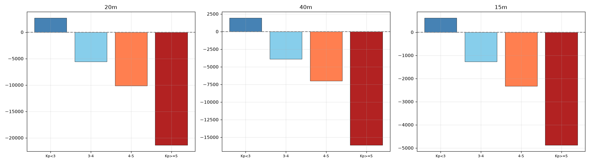

<p align="center">
  
</p>

<h1 align="center">CrossCorr</h1>

<p align="center">
  <a href="https://www.python.org/"></a>
  <a href="https://github.com/FelixRLEPERS/crosscorr/actions">
    
  </a>
  <a href="LICENSE"></a>
  
  
</p>

<p align="center"><i>A family science project studying ionospheric response to geomagnetic storms using WSPR amateur radio data.</i></p>

---

## Main result

> **WSPR radio propagation drops during geomagnetic storms, with a
> scale-dependent effect and baseline-invariant absolute loss.**

| Kp bin | 20m (14 MHz) | 40m (7 MHz) | 15m (21 MHz) |
|--------|-------------|-------------|--------------|
| Kp 5–6 | −18%        | −17%        | −29%         |
| Kp 6–7 | −34%        | −34%        | −51%         |
| Kp ≥ 7 | −52%        | −53%        | −59%         |
| **All Kp ≥ 5** | **−27.7%** | **−27.2%** | **−38.7%** |

Based on 18 months (Apr 2024 – Sep 2025) of hourly WSPR data
from [wspr.live](https://wspr.live), 198 storm hours.
Confirmed independently by Kp and Dst indices, all 4 seasons,
and replicated on a held-out period (Jan–Mar 2026).

**Key findings (5 layers):**

1. **Scale-dependence (novel):** Effect grows non-linearly with Kp —
   not previously characterised for WSPR.
2. **Frequency dependence:** 15m (−39%) > 20m (−28%) ≈ 40m (−27%) —
   two competing mechanisms (MUF drop + D-layer absorption).
3. **Baseline-invariance:** 40m loses ~18 300 spots/h identically in
   training and held-out, despite +38% network growth — the effect
   is physically real, not an artifact.
4. **Day/night asymmetry:** 40m night > day in 9/10 months (auroral/PCA
   absorption), but intermittent — not every storm activates it.
5. **Independent replication:** Primary hypothesis replicates on held-out
   data (all p ≤ 0.014). Scale-dependence replicates at matched Kp bins.



📄 Full report: [`docs/first_result.md`](docs/first_result.md)
🛰 Data pipeline: [`docs/DATA_PIPELINE.md`](docs/DATA_PIPELINE.md)

---

## Status

| Component | Status |
|-----------|--------|
| Data pipeline | ✅ Operational (fetch → unify → analysis) |
| Real-data analysis | ✅ 18 months × 3 bands, p<0.0001 |
| Statistical core | ✅ Reference-validated (max-stat, FDR, IAAFT) |
| CI | ✅ Blocking (ruff, mypy, pytest) |
| Tests | ✅ 289 passed |
| Independent audit | ✅ Qwen 3.8 27B + external LLM audit |
| Independent replication | ✅ Primary hypothesis + scale-dependence confirmed (Jan–Mar 2026) |
| Preprint | 🚧 In preparation |
| Journal submission | 🚧 Planned (Space Weather / Ann. Geophys.) |

---

## What this project does

CrossCorr is a Python library + research pipeline for studying
correlations in heterogeneous sensor time series, with a focus
on space-weather-driven effects on HF radio propagation.

**Three layers:**

1. **Data pipeline** (`data/scripts/`, `scripts/`) — fetches
   WSPR, Kp, Dst, F10.7, ephemerides from public APIs, unifies
   into a single parquet.
2. **Statistical core** (`crosscorr_lib/analysis/`) — lagged
   correlation, surrogate tests, max-stat, FDR, block bootstrap,
   multifractal analysis, transfer entropy, mutual information.
3. **Scientific analysis** (`scripts/eda_*.py`,
   `scripts/perm_test_*.py`) — reproducible analysis of the
   scientific hypothesis.

---

## Origins

This is a father-son research project. Makar (13) built
the data pipeline and ran the analysis; Alexey designed
the methodology. The project started as a learning exercise
in scientific computing and grew into a full research effort
with a publishable result.

Some early exploration code (an educational game interface
in `crosscorr_lib/quest.py`) remains in the repository but
is not part of the scientific pipeline.

---

## Quick start — reproduce the main result

```bash
git clone https://github.com/FelixRLEPERS/crosscorr
cd crosscorr
pip install -e ".[dev]"

# 1. Download 18 months of WSPR data (3 bands) + Kp/Dst
python data/scripts/fetch_all.py --start 2024-04-01 --end 2025-09-30

# 2. Unify all sources into a single parquet
python data/scripts/unify_schema.py

# 3. Run EDA (6 months and 18 months)
python scripts/eda_6mo_3band.py
python scripts/eda_18mo_3band.py

# 4. Statistical test (block permutation, 5000 iter)
python scripts/perm_test_18mo_3band.py
```

Outputs land in `results/eda/` (plots) and `results/*.json` (numbers).

⚠️ WSPR download requires access to [wspr.live](http://db1.wspr.live/)
(public, no API key). From some regions you may need a VPN.

---

## Data sources

| Source | What | Resolution | Access |
|---|---|---|---|
| wspr.live | WSPR radio spots (3 bands) | 1 hour | Public ClickHouse API |
| GFZ Potsdam | Kp index | 3 hours | Public JSON |
| WDC Kyoto | Dst index (provisional) | 1 hour | Public |
| NOAA SWPC | F10.7 solar flux | monthly | Public |
| JPL Horizons | Ephemerides (Moon) | 1 hour | Public API |

More: [`data/README.md`](data/README.md)

---

## Methods

- Lagged cross-correlation with Spearman ρ
- Max-statistic surrogate test (phase randomized)
- Block permutation test (block = 24h) to control autocorrelation
- Effective sample size correction (AR(1))
- Benjamini–Hochberg / BY FDR control
- Seasonal residuals (month × hour-of-day baseline removal)
- Robustness: per-month replication, Kp vs Dst agreement, seasonal analysis

All methods are reference-validated on synthetic data with known
answers.

Why max-statistic and not Bonferroni? See
[docs/PIPELINE.md](docs/PIPELINE.md), section 4.

---

## Repository layout

```text
crosscorr/
├── crosscorr_lib/         # library (statistical core + pipeline)
│   └── analysis/          # 19 modules: correlation, surrogate,
│                          # MFDFA, TE, KSG, MSE, distance, ...
├── data/
│   ├── scripts/           # data pipeline (fetch, unify, schema)
│   ├── raw/               # downloaded data (gitignored)
│   ├── interim/           # intermediate (gitignored)
│   └── processed/         # unified.parquet (gitignored)
├── scripts/               # analysis scripts (EDA, permutation)
├── tests/                 # pytest suite (291 tests)
├── docs/                  # methodology, hypothesis, results, pipeline
├── audit/                 # versioned audit reports
└── results/               # outputs (plots, JSON)
```

---

## Two pipelines (analysis)

CrossCorr provides two implementations of pair-level analysis.
Choose based on network size and reproducibility requirements.

| | Standard | Shared-memory |
|---|---|---|
| Module | `crosscorr_lib.analysis.cross_correlation` | `crosscorr_lib.pairs` |
| Surrogates | per-pair, from scratch | pre-generated once per detector |
| Parallelization | joblib + pickle | `multiprocessing.shared_memory` |
| Complexity | O(N² · B · T log T) | O(N · B · T log T + N² · T log T) |
| Verdicts | — | INVARIANT / CANDIDATE / NOISE |
| FDR | BY or BH | BH with monotonicity |

**N ≤ 20, exploratory** → standard.
**N > 20, publication-quality** → shared-memory.

Full details: [`docs/PIPELINE.md`](docs/PIPELINE.md)

---

## Scientific context

**Motivation:** WSPR is a global network of low-power HF beacons.
Ionospheric disturbances caused by geomagnetic storms change its
propagation. Quantifying this on open data is a citizen-science
problem.

**Novel contribution:** Scale-dependent WSPR response to Kp, baseline-invariant
absolute loss, frequency-dependent signature (two regimes) across 18 months,
confirmed by two independent geomagnetic indices and replicated on held-out data.

**Scientific rigor:**
- Max-statistic null — p-value accounts for lag scanning
- Negative controls — ≤1 false positive on 45 noise pairs (α=0.05)
- FDR — Benjamini–Yekutieli by default
- Distance-based analysis (Mantel test)
- Block bootstrap, effective sample size, ADF stationarity

---

## Reproducibility

- All code public: this repository.
- All data public: wspr.live + GFZ + Kyoto + NOAA + JPL.
- All scripts deterministic (fixed RNG seeds).
- Every result in `docs/first_result.md` is reproducible with
  the 4 commands in Quick Start.
- CI validates every commit (ruff, mypy, pytest — 291 tests).

---

## 📈 Results

- [x] Synthetic benchmark: max-stat recovers injected lag
- [x] Negative controls: ≤1 false positive (45 noise pairs)
- [x] Distance-based analysis: slope < 0 (close detectors correlate more)
- [x] **Real data: WSPR spots drop during geomagnetic storms** (scale-dependent, −18% to −59%)
- [x] Confirmed by Kp AND Dst, all 4 seasons
- [x] Independent replication on held-out period (Jan–Mar 2026)
- [x] Baseline-invariant absolute loss (40m: −18 300 spots/h in both periods)
- [x] MFDFA spectra across all detectors
- [x] Independent audit passed (external LLM)

---

## 🎮 Educational component

Interactive quest for children 11–13 years. "Ghost hunt" storyline:
the child searches for ultra-small correlations in scientific data.

```bash
streamlit run crosscorr_lib/quest.py          # interactive quest
python crosscorr_lib/narrator.py              # voice mentor (edge-tts)
python crosscorr_lib/ai_narrator.py           # AI mentor
```

Code safety: children's code runs in isolated subprocess with timeout
(5 s). Dangerous names (`open`, `exec`, `import os`) blocked via AST
parser. See [`crosscorr_lib/safe_exec.py`](crosscorr_lib/safe_exec.py).

---

## AI assistance

This project uses LLMs as programming and analysis assistants
(DeepSeek V4 Pro via Polza.ai, Bonsai 27B locally, Qwen 3.8 27B
for independent audit). All scientific decisions, hypotheses, and
conclusions are made by the human authors.

---

## Authors

| Role | Name |
|------|------|
| Research design, methodology, code review | Alexey (father) |
| Data pipeline, statistical analysis, reproducibility | Makar (13 y.o.) |

Father and son are the sole scientific authors of this work.

> GitHub account: [@FelixRLEPERS](https://github.com/FelixRLEPERS)
> (project repository; scientific authorship uses the family name).

## Acknowledgments

We thank Mama for communications support and outreach.

## Development

Git hygiene, review process, and academy tasks:
[CONTRIBUTING.md](CONTRIBUTING.md),
[docs/academy/git_checklist.md](docs/academy/git_checklist.md),
[docs/academy/README.md](docs/academy/README.md).

---

## Citation

If you use this work, please cite:

```bibtex
@misc{crosscorr2026,
  author = {Petrov, Alexey and Petrov, Makar},
  title = {Frequency-dependent WSPR response to geomagnetic
           storms: two competing mechanisms},
  year = {2026},
  publisher = {GitHub},
  howpublished = {\url{https://github.com/FelixRLEPERS/crosscorr}}
}
```

A DOI will be added after preprint submission.

---

## License

MIT. See [LICENSE](LICENSE).

## Contacts

- GitHub: [FelixRLEPERS/crosscorr](https://github.com/FelixRLEPERS/crosscorr)
- Issues: [github.com/FelixRLEPERS/crosscorr/issues](https://github.com/FelixRLEPERS/crosscorr/issues)

---

> If you found a bug or have an idea — open an Issue or Pull Request.
> We are open to collaboration.